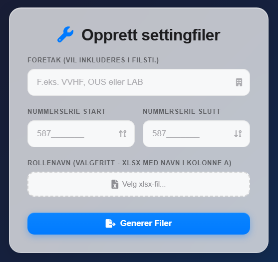

# Settingfil-generator for telefonsystem

Et program for å generere konfigurasjonsfiler for Helselogistikk. Applikasjonen lager både `.phn`-filer for Avaya og `.json`-filer for Ascom.

Løsningen støtter to arbeidsmåter via faner:

- **Singel opprettelse**: Generer filer for én telefon (IMEI + telefonnummer + firstname/lastname)
- **Multiple opprettelser**: Generer filer fra nummerserie eller via import av `.xlsx`

## Funksjoner

### 📱 Filer som genereres
- **Avaya `.phn`-filer** med kryptografisk sikre passord:
  ```
  SET SIPUSERNAME [nummer]
  SET SIPUSERPASSWORD [passord]
  GET /mdm/[kode]/avaya/rw-sikt.txt
  ```

- **Ascom `.json`-filer** med enhets-ID:
  ```json
  {"voip_device_id": "[nummer]"}
  ```

### 📊 Import/rollemapping (valgfritt)

Ved **Multiple opprettinger** kan du laste opp en `.xlsx`-fil **uten headere**:

- **Kolonne A**: IMEI (15 siffer)
- **Kolonne B**: Navn (brukes som `FIRSTNAME` i output)
- **Kolonne C**: Foretak + lokasjon (brukes som `LASTNAME` i output, og som code i filstien)

Applikasjonen genererer samtidig et output-regneark (`.xlsx`) med kolonner:

- **FIRSTNAME**
- **LASTNAME**
- **Nummer**
- **Passord**

### 🔐 Sikkerhet
- Passord genereres med `secrets`-modulen (kryptografisk sikker)
- Kun tall, store og små bokstaver (ingen spesialtegn)
- Maks lengde: 15 tegn
- Minst én av hver: liten bokstav, stor bokstav, siffer

### 🎨 Design
- **iOS 26 Glassmorphism** med glass-effekter
- Mørk gradient bakgrunn
- Semi-transparente elementer med blur
- Optimalisert for desktop-bruk

### ⚡ Ytelse
- Server-Sent Events (SSE) for sanntids fremdrift
- Automatisk opprydding av midlertidige filer
- Komprimert ZIP-eksport

## Forhåndsvisning

Forhåndsvisning av applikasjonen:

<div align="center">
  
</div>

## Installasjon

1. Klon dette repositoriet:
   ```bash
   git clone [repo-url]
   cd phone-generator
   ```

2. Installer avhengigheter:
   ```bash
   pip install -r requirements.txt
   ```

## Bruk

### 1. Start applikasjonen
```bash
python app.py
```
Åpne nettleseren og gå til `http://localhost:5000`

### 2. Generer filer

#### A) Singel opprettelse

Fyll inn:

- **Foretak**
- **IMEI (15 siffer)**
- **Telefonnummer**
- **Firstname**
- **Lastname**

Klikk **Generer Filer**.

**Merk:**

- `.phn` og `.json` filnavn er IMEI (`<imei>.phn` og `<imei>.json`)
- Innholdet bruker telefonnummer som SIP-brukernavn (`SIPUSERNAME`) og som `voip_device_id` i `.json`
- ZIP-filen navngis: `code_phone_yyyymmddHHMM.zip`

#### B) Multiple opprettinger

Du kan enten:

- Generere fra nummerserie (start/slutt), eller
- Laste opp `.xlsx` (se formatet over)

Klikk **Generer Filer**.

ZIP-filen navngis: `code_start_end_yyyymmddHHMM.zip`

### 3. Last ned
Når genereringen er ferdig, lastes ned en ZIP-fil som inneholder:
- `/avaya/` - Alle `.phn`-filer
- `/ascom/` - Alle `.json`-filer  
- `output_[kode].xlsx` - Regneark med output

## Teknologi

- **Backend**: Flask (Python)
- **Frontend**: HTML5, CSS3, JavaScript (ES6+)
- **Design**: iOS 26 Glassmorphism
- **Sikkerhet**: `secrets`-modulen for passordgenerering
- **Filhåndtering**: `openpyxl` for xlsx-støtte
- **Real-time**: Server-Sent Events (SSE)

## Filtyper

| Filtype | Format | Bruk |
|---------|--------|------|
| `.phn` | Tekst | Avaya telefonsystem |
| `.json` | JSON | Ascom telefonsystem |
| `.xlsx` | Excel | Rollemapping (output) |

## Sikkerhet

- Alle passord genereres med `secrets.choice()` for kryptografisk sikkerhet
- Midlertidige filer slettes automatisk etter nedlasting
- Filnavn valideres for å forhindre path traversal

## Filstruktur

```
phone-generator/
├── app.py                # Hovedapplikasjonen
├── requirements.txt      # Avhengigheter
├── README.md             # Denne filen
├── .gitignore            # Git ignore-fil
├── static/
│   ├── css/
│   │   └── style.css    # iOS 26 Glassmorphism stil
│   ├── js/
│   │   └── script.js    # Klientdelslogikk med filopplasting
│   └── images/
│       └── bilde.png    # Skjermbilde av applikasjonen
└── templates/
    └── index.html       # Hovedmal med filopplasting
```

## Avhengigheter

- Python 3.7+
- Flask 2.3.3
- Werkzeug 2.3.7
- openpyxl 3.1.2
- python-dotenv 1.0.0

Installer med:
```bash
pip install -r requirements.txt
```

## Lisens

MIT License
